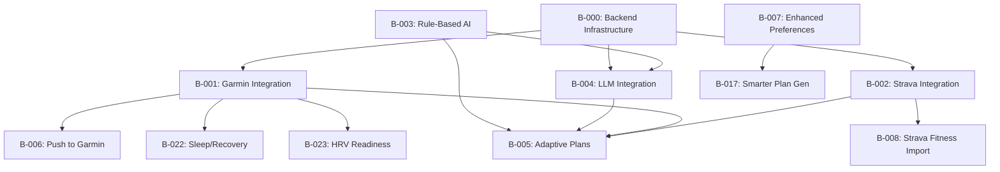

# Development Workflow

This workflow provides the recommended order for developing features from BACKLOG.md, incorporating all 30 backlog items with dependency analysis, rationale, and time estimates.

**Total Estimated Effort: ~300-430 hours**

---

## Sprint 0: Friends & Family MVP (36-60 hours)

Focus on getting a deployable, testable app to real users before building complex features.

### 0.0 Critical Infrastructure Prerequisites ✅ COMPLETE
**Estimate: 2-4 hours** | **Completed: Dec 9, 2024**

| Dependency | Rationale |
|------------|-----------|
| None | Security and UX blockers. Cannot deploy without these. |

**Tasks:**
1. Move Supabase credentials to `.env` file (security fix - hardcoded credentials can be extracted from deployed bundle)
2. Use `import.meta.env` for all environment variables
3. Install and configure `react-router-dom` for proper navigation (required for bookmarkable URLs, back button, PWA experience)

---

### 0.1 Production Deployment (B-027) ✅ COMPLETE
**Estimate: 4-8 hours** | **Completed: Dec 9, 2024** | **URL:** https://triathlontrainingcoach.vercel.app/

| Dependency | Rationale |
|------------|-----------|
| 0.0 Prerequisites | Get the app online first. Real user feedback > perfect features. Validate core value proposition before investing in integrations. |

**Tasks:**
1. Deploy to Vercel (works well with Vite)
2. Configure environment variables (Supabase URL/key)
3. Configure Supabase redirect URLs for production
4. Test all features in production
5. Invite friends/family to test

**Follow-up:** Add Sentry error tracking (B-031) after initial deployment is stable.

---

### 0.2 Automated Testing (B-029) 🔶 PARTIAL
**Estimate: 4-6 hours** | **Vitest configured, initial tests added**

| Dependency | Rationale |
|------------|-----------|
| None | Establish test coverage before adding features. Catching regressions manually becomes impossible as codebase grows. |

**Tasks:**
1. Configure Vitest
2. Write tests for plan generation logic
3. Write tests for HR zone calculation
4. Write tests for date/time utilities
5. Set up CI integration (run on push)

---

### 0.3 Enhanced Training Preferences (B-007)
**Estimate: 8-12 hours**

| Dependency | Rationale |
|------------|-----------|
| None | Plans that fit real schedules = higher user retention. This is the #1 feedback from early v1 testing. |

**Tasks:**
1. Update `AthleteProfile` type with preference fields
2. Add preferences step to `AthleteProfileWizard`
3. Update `ProfilePage` to display/edit preferences
4. Modify `generateTrainingPlan` to use preferences
5. Test preference-based plan generation

---

### 0.4 Mobile PWA Optimization (B-019)
**Estimate: 10-14 hours**

| Dependency | Rationale |
|------------|-----------|
| None | Athletes check plans on phones before workouts. Mobile experience is critical for daily engagement. |

**Tasks:**
1. Create service worker for offline support
2. Add manifest.json for installability
3. Implement offline workout caching
4. Set up push notification service
5. Mobile-optimized UI refinements
6. Test on mobile devices

---

### 0.5 Metric/Imperial Unit Preferences (B-028)
**Estimate: 6-10 hours**

| Dependency | Rationale |
|------------|-----------|
| None | Canadian/European users cannot use app effectively without metric support. Blocks adoption for ~50% of potential users. |

**Tasks:**
1. Add user preference in profile (metric/imperial)
2. Implement distance display conversion (km ↔ miles)
3. Implement pace display conversion (min/km ↔ min/mile)
4. Add pool length options (25m, 50m, 25yd)
5. Ensure consistent formatting throughout all views
6. Default based on browser locale

---

## Sprint 1: Integration Infrastructure (6-10 hours)

Backend infrastructure that unblocks external integrations (Garmin, Strava, LLM APIs).

### 1.1 Backend Infrastructure (B-000 - Remaining Items)
**Estimate: 6-10 hours**

| Dependency | Rationale |
|------------|-----------|
| Sprint 0 complete | Foundation for OAuth, secure API keys, and webhooks. Blocks: B-001, B-002, B-004, B-006 (4 high-value features). |

**Tasks:**
1. Create Supabase Edge Functions project structure
2. Set up OAuth token storage table (encrypted)
3. Create webhook endpoints for activity notifications
4. Configure CORS for Edge Functions (allows your frontend domain to call your backend)
5. Add "Forgot Password" UI flow (Supabase built-in)

---

## Sprint 2: Dashboard & Analytics (22-30 hours)

User-facing improvements that drive engagement and retention.

### 2.1 Improved Dashboard (B-009)
**Estimate: 10-14 hours**

| Dependency | Rationale |
|------------|-----------|
| Workout completion data | Dashboard is the daily touchpoint. A compelling dashboard increases daily active usage and habit formation. |

**Tasks:**
1. Design new dashboard layout
2. Add today's workout card with full details
3. Create weekly calendar strip with status indicators
4. Implement training load chart (last 6 weeks)
5. Add race countdown with phase indicator
6. Display compliance percentage this week/month
7. Show current training streak

---

### 2.2 Enhanced Analytics (B-010)
**Estimate: 12-16 hours**

| Dependency | Rationale |
|------------|-----------|
| Workout completion data, benefits from B-003 | Athletes want race readiness confidence. Analytics answer "Am I on track?" reducing anxiety and building trust. |

**Tasks:**
1. Create race readiness gauge (0-100%)
2. Build compliance chart by week and discipline
3. Add time-in-discipline breakdown
4. Implement intensity zone distribution chart
5. Volume trend visualization with plan overlay
6. Generate key insights summary

---

## Sprint 3: Intelligence & Coaching (32-48 hours)

Rule-based AI that works offline before investing in LLM infrastructure.

### 3.1 Rule-Based Expert System (B-003)
**Estimate: 6-10 hours**

| Dependency | Rationale |
|------------|-----------|
| 2 weeks of training data | Foundational coaching logic. No API costs, works offline, fast iteration. Must exist before LLM for context. |

**Tasks:**
1. Extend `trainingAdvisor.ts` with new rules
2. Add intensity distribution calculation (polarized training check)
3. Implement fatigue detection (RPE trends)
4. Track completion rate and volume trends
5. Create weekly summary generator
6. Display insights on Analytics page

---

### 3.2 Smarter Plan Generation (B-017)
**Estimate: 20-30 hours**

| Dependency | Rationale |
|------------|-----------|
| B-007 (Enhanced Preferences) | Core differentiator. Proper periodization science makes plans actually effective vs. "random workouts." |

**Tasks:**
1. Implement proper mesocycle structure (3:1 or 2:1 load:recovery)
2. Add key workout placement logic (not random)
3. Schedule brick workouts appropriately
4. Auto-schedule recovery weeks every 3-4 weeks
5. Calculate distance-appropriate taper
6. Address athlete's weakest discipline

---

### 3.3 LLM Integration (B-004)
**Estimate: 12-18 hours**

| Dependency | Rationale |
|------------|-----------|
| B-000 (Backend), B-003 (Rules) | Natural language explanations add polish and personalization. Requires rule data for context. |

**Tasks:**
1. Set up LLM API access via backend
2. Create system prompts for coaching context
3. Implement "Why this workout?" explainer
4. Build weekly narrative summary generator
5. Add chat interface for Q&A
6. Implement token usage tracking

---

## Sprint 4: External Integrations (29-42 hours)

Connect to the platforms athletes already use.

### 4.1 Strava Integration (B-002)
**Estimate: 8-12 hours**

| Dependency | Rationale |
|------------|-----------|
| B-000 (Backend) | Wider device compatibility than Garmin. Faster approval (~24 hours vs. 1-2 weeks for Garmin). Start here. |

**Tasks:**
1. Set up Strava API application
2. Implement OAuth 2.0 flow via backend
3. Create activity import handler
4. Map Strava activities to app format
5. Build connected account UI
6. Activity matching: planned vs. actual

---

### 4.2 Strava Fitness Import (B-008)
**Estimate: 6-10 hours**

| Dependency | Rationale |
|------------|-----------|
| B-002 (Strava Integration) | Use existing training history for smarter starting point. Requires Strava connection first. |

**Tasks:**
1. Fetch fitness/freshness data from Strava
2. Display fitness trend on dashboard
3. Use CTL to inform starting training load
4. Add ramp rate warnings

---

### 4.3 Garmin Connect Integration (B-001)
**Estimate: 15-20 hours**

| Dependency | Rationale |
|------------|-----------|
| B-000 (Backend) | Most popular device ecosystem for triathletes. OAuth 1.0a is more complex. Developer approval takes 1-2 weeks. |

**Tasks:**
1. Apply for Garmin Developer API access (lead time: 1-2 weeks)
2. Implement OAuth 1.0a flow
3. Create activity sync handler
4. Set up webhook for real-time sync
5. Import HR zones from Garmin

---

## Sprint 5: Device Integration (14-20 hours)

Push structured workouts to devices for guided execution.

### 5.1 Push Workouts to Garmin (B-006)
**Estimate: 14-20 hours**

| Dependency | Rationale |
|------------|-----------|
| B-001 (Garmin Integration) | The "killer feature" for Garmin users. Structured coaching on the wrist. Requires existing Garmin auth. |

**Tasks:**
1. Refactor `WorkoutStep` type to structured data format
2. Map workout format to Garmin Training API JSON schema
3. Support all step types: warmup, interval, recovery, rest, cooldown
4. Support targets: HR zone, power zone, pace range, open
5. Handle swim workouts (pool length, stroke type, rest intervals)
6. "Send to Garmin" button on workout detail view
7. Bulk sync option for upcoming week
8. Handle conflicts (workout already exists)
9. Test on actual Garmin devices

---

## Sprint 6: Library & Content (12-18 hours)

Expand workout variety and selection.

### 6.1 Expanded Workout Library (B-012)
**Estimate: 8-12 hours**

| Dependency | Rationale |
|------------|-----------|
| None | Users want variety. Bigger library = more swapping options = personalized plans. |

**Tasks:**
1. Add 50+ swim workouts (drills, intervals, endurance)
2. Add 50+ bike workouts (sweet spot, threshold, VO2max)
3. Add 50+ run workouts (tempo, intervals, long runs)
4. Add 20+ strength/mobility workouts
5. Add search by type, duration, intensity
6. Implement favorite workouts
7. Swap workout in plan with library alternative

---

### 6.2 Brick Workout Support (B-024)
**Estimate: 4-6 hours**

| Dependency | Rationale |
|------------|-----------|
| B-012 (Expanded Library) | Brick workouts exist in library but need proper scheduling and progression logic. |

**Tasks:**
1. Ensure brick workout type coverage in library
2. Schedule in build/peak phases
3. Implement progressive brick duration
4. Track T2 simulation practice

---

## Sprint 7: Standalone Enhancements (16-24 hours)

Features that add value without complex dependencies.

### 7.1 Calendar Export (B-020)
**Estimate: 4-6 hours**

| Dependency | Rationale |
|------------|-----------|
| None | Small effort, high convenience. Athletes can block training time in work calendars. |

**Tasks:**
1. Create iCal generation utility
2. Add export button to training plan view
3. Generate subscribe URL for live sync
4. Test with Google Calendar

---

### 7.2 Indoor/Outdoor Bike Separation (B-016)
**Estimate: 6-10 hours**

| Dependency | Rationale |
|------------|-----------|
| Update AthleteProfile | Power-based indoor vs. RPE outdoor is a common athlete setup. Makes workouts more usable. |

**Tasks:**
1. Add to profile: Indoor power meter (yes/no)
2. Add to profile: Outdoor power meter (yes/no)
3. Tag workouts as indoor/outdoor capable
4. Show power targets only when power available
5. Suggest indoor when weather bad + trainer available

---

### 7.3 Weather Forecast Integration (B-015)
**Estimate: 6-10 hours**

| Dependency | Rationale |
|------------|-----------|
| Weather API, user location | Nice-to-have for outdoor planning. Connects naturally to B-016 indoor/outdoor suggestions. |

**Tasks:**
1. Integrate weather API (OpenWeatherMap or similar)
2. Show weather forecast on today's workout
3. 7-day forecast for planned workouts
4. Suggest indoor alternative if bad weather
5. Heat/cold alerts for safety

---

## Sprint 8: Multi-Race Planning (15-20 hours)

Support athletes with race seasons.

### 8.1 Multiple Race Goals (B-013)
**Estimate: 15-20 hours**

| Dependency | Rationale |
|------------|-----------|
| Major refactor of plan generation | Most competitive triathletes have 2-5 races per season. Single-race plans are limiting. |

**Tasks:**
1. Add multiple races with A/B/C priority
2. Plan builds to A-race peak
3. Reduced taper for B-races
4. Minimal taper for C-races
5. Recovery weeks scheduled after races
6. Visual race calendar

---

## Sprint 9: Recovery & Readiness (18-27 hours)

Physiological metrics for smarter training.

### 9.1 Sleep & Recovery Integration (B-022)
**Estimate: 10-15 hours**

| Dependency | Rationale |
|------------|-----------|
| B-001 (Garmin Integration) | Garmin already tracks sleep/recovery. Use existing data for training adjustments. |

**Tasks:**
1. Import Garmin sleep/Body Battery data
2. Display recovery status on dashboard
3. Suggest intensity adjustment when low recovery
4. Track sleep trends

---

### 9.2 HRV Readiness (B-023)
**Estimate: 8-12 hours**

| Dependency | Rationale |
|------------|-----------|
| B-001 or compatible integration | Objective daily readiness measurement. Reduces injury/illness risk. |

**Tasks:**
1. Manual HRV entry option
2. Import HRV from Garmin/Oura
3. Display readiness score
4. Suggest workout modification based on HRV

---

## Sprint 10: AI-Powered Adaptation (35-49 hours)

The most complex, high-value feature. Saved for last due to dependencies.

### 10.1 Race Time Predictor (B-011)
**Estimate: 10-14 hours**

| Dependency | Rationale |
|------------|-----------|
| B-003 or B-004 (AI Coaching), 8+ weeks training data | Athletes want race goal validation. Builds confidence and sets realistic expectations. |

**Tasks:**
1. Predict finish time based on training data
2. Account for race distance and course profile
3. Factor in historical race results
4. Provide confidence interval (best/expected/worst)
5. Explain prediction factors
6. Update prediction as training progresses

---

### 10.2 Adaptive Plan Generation (B-005)
**Estimate: 25-35 hours**

| Dependency | Rationale |
|------------|-----------|
| B-003 (Rules), B-004 (LLM), B-001 or B-002 (actuals) | The "holy grail" feature. Requires all upstream intelligence and data. Saves for when ecosystem is mature. |

**Tasks:**
1. Detect missed workouts and auto-adjust
2. "Sick mode" triggers recovery protocol
3. Travel dates adjust workout types
4. Auto-generate taper for A-races
5. Post-race recovery focus
6. User can accept/reject adjustments

---

## Future Backlog (Low Priority)

Features to consider after core platform is solid.

| Item | Feature | Hours | Rationale for Deferral |
|------|---------|-------|------------------------|
| B-014 | Nutrition Planning | 20-30 | Large new domain, not core to training plans |
| B-018 | Non-Triathlon Events | 15-20 | Broadens scope; after B-013 Multiple Races |
| B-021 | Social/Community | 25-35 | Infrastructure heavy; focus on training first |
| B-025 | Open Water Swim | 6-8 | Nice-to-have; depends on weather integration |
| B-026 | Equipment Tracking | 8-12 | Nice-to-have; not training-critical |
| B-030 | Account Deletion | 2-3 | GDPR compliance; add when user base grows |

---

## Dependency Graph

---

## Notes

- **Effort estimates assume AI-assisted development** with Claude Opus 4.5 + Antigravity IDE
- Update BACKLOG.md status as you complete features
- Commit after each feature completion
- Test thoroughly before moving to dependent features
- Sprint 0 (MVP) is prioritized for immediate user feedback
